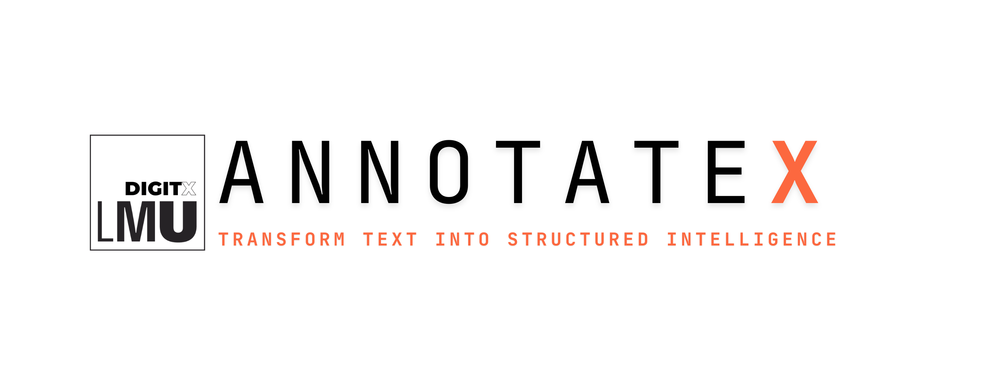

<p align="center">
  <picture>
    <source media="(prefers-color-scheme: dark)" srcset="./public/assets/Annotatex-dark-mode.png" />
    
  </picture>
</p>

<p align="center">
  
  
  
</p>

<p align="center">
  
  
  
  
  
  
</p>

A free, on-prem text annotation workspace designed for creating gold-standard structured datasets.

AnnotateX helps you highlight text, label important information, and define how pieces of text relate to each other. As you tag and structure your text, AnnotateX automatically creates a consistent knowledge graph and structured data output (JSON), keeping everything synchronized and ready for NLP, analytics, or training large language models.

Use AnnotateX to easily build clear, structured datasets that become the trusted reference (“gold standard”) for AI systems to learn from.


## ⚙️ What AnnotateX Does

- Highlight and label words or phrases in text.
- Define connections and relationships between labeled items.
- See a live knowledge graph of your structured annotations.
- Export clean, structured data for use in AI and NLP pipelines.
- Runs fully on-prem, keeping all your data private and secure.


## 🚀 Why Use AnnotateX?
- To create high-quality training data for NLP and large language models.
- To build reliable, structured datasets quickly and clearly.
- To maintain full control over your sensitive or private text data.

## 🧩 In Short:

AnnotateX helps you easily turn plain text into structured data, ready for AI and analytics.

## Highlights

- **Multi-Document Workspace** – load an entire folder (txt/pdf), navigate with arrow buttons or `⌥ ←/→`, and see progress + status for each asset.
- **Fluid Text Annotation** – select spans directly in the editor to summon a floating label palette. Badges display label, sentiment, and metadata inline.
- **Custom Label Properties** – define any number of per-label fields (e.g., lesion location, severity) and edit them inline or via the workbench.
- **Schema-as-a-Feature** – define labels, colors, and optional metadata requirements. Schema changes apply instantly across the UI.
- **Annotation Workbench** – inspect spans, update metadata, review linked relationships, and bulk-clear edges without leaving the page.
- **Interactive Graph** – every annotation becomes a draggable node. Draw edges to propose relationships, confirm direction + type in a dialog, and delete edges with a keystroke.
- **Live JSON + Export** – JSON view mirrors current state; export JSON/CSV per document with RFC‑4180-safe CSV quoting.
- **On-Prem Ready** – stateless Vite/React front-end deploys behind your firewall via Docker, Docker Compose, or any static host + API stack.

---

## Getting Started

### Prerequisites

- Node.js 18+ (use [nvm](https://github.com/nvm-sh/nvm) for convenience)
- npm 9+

### Local Development

```bash
git clone https://github.com/LalithShiyam/annotatex.git
cd annotatex
npm install
npm run dev
```

### Production Build

```bash
npm run build
npm run preview   # optional: serves the dist bundle at http://localhost:4173
```

### Docker / Compose

```bash
docker-compose up -d
# or
docker build -t annotatex .
docker run --rm -p 8080:80 annotatex
```

The default Nginx config (see `nginx.conf`) serves the optimized build at `http://localhost:8080`.

---

## Example Workflow

A sample chest X-ray report is preloaded so you can see how AnnotateX validates structured AI output:

1. Select spans like “Patchy airspace opacities in the right mid and lower lung…”
2. Assign schema labels (Cardiomegaly, Pleural effusion, Pneumothorax, Consolidation, Pneumonia) and fill in their properties (presence, severity).
3. Live JSON mirrors each edit; export the reviewer-approved structure for downstream systems.

---

## Architecture Overview

- **Frontend stack**: Vite + React 18 + TypeScript, shadcn/ui + Tailwind for components, React Flow for graph interactions.
- **State shape**: page-level `Index.tsx` owns text, annotations, relationships, schema, and selected annotation.
- **Annotation model**: includes `labelId`, `metadata`, and relationships referencing annotation IDs.
- **Exports**: JSON mirrors in-memory state; CSV includes columns for text span, label, sentiment, confidence, notes.

---

## Documentation

- Product & architecture guide: `docs/ANNOTATEX.md`
- Deployment: `DEPLOYMENT.md`

---

## Branding Notes

- Place GitHub banners at `public/assets/github-banner-light.png` and `public/assets/github-banner-dark.png`.
- Swap `public/favicon.svg` with your lab mark for browser tabs.
- Drop `public/brand-banner.jpg` to replace the in-app header hero.

## License

Apache-2.0
